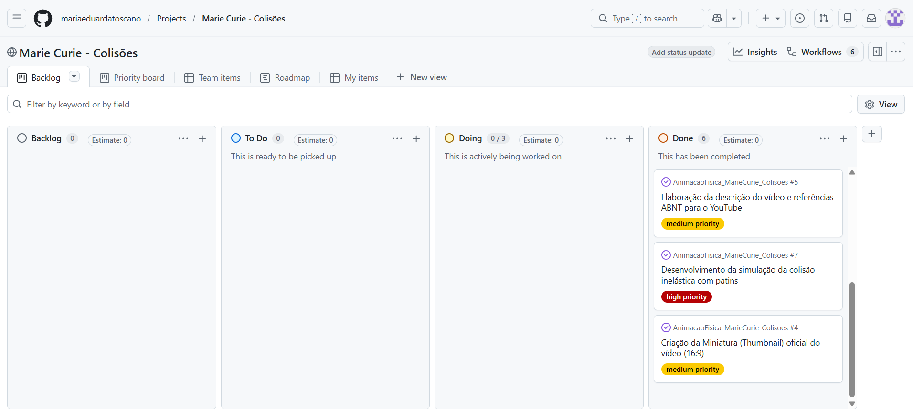

**Marie Curie - Colisões** 
    **2026 – Rio de Janeiro**

> Alunas: 

Ana Aparecida Alves da Silva Maria - Matrícula:

Giovana Menezes Teles Gomes - Matrícula:

Isadora Dias De Souza - Matrícula:

Karina Frota da Silveira Elliot  - Matrícula:

Maria Eduarda Toscano - Matrícula: 202420574811 

Rayssa Borges de Oliveira - Matrícula:

> Professora:

Érika Dias Cabral.

> Nome e tema:
Nome: Colisões Curie.
Grupo: Marie Curie.
Tema: Colisões

> Justificativa da Escolha:

Escolhemos Marie Curie por ter sido a pioneira nos estudos da física nuclear e da radioatividade, ela descobriu os elementos químicos polônio e rádio, provando que a radiação vinha do interior dos próprios átomos, além de ser a primeira pessoa e única mulher a ganhar dois Prêmios Nobel em áreas científicas distintas (Física e Química). Embora nosso foco seja a mecânica clássica das colisões, a física moderna e o estudo das partículas subatômicas dependem fundamentalmente da análise de colisões e da conservação do momento linear para mapear de forma mais abrangente o universo invisível.
Apesar de não ter estudado colisões macroscópicas diretamente, seu trabalho pioneiro com partículas radioativas (emissão de partículas alfa, beta) forneceu as “balas” usadas nos primeiros experimentos de colisão e espalhamento em física atômica, como o experimento de espalhamento de Rutherford, que  usou fontes radioativas descobertas por ela. Além disso, é uma figura essencial para representar mulheres na ciência, e o grupo quis homenagear sua trajetória.

> Breve biografia de Marie Curie: 
Marie Skłodowska Curie (1867–1934) foi uma física e química polonesa naturalizada francesa, reconhecida por seus estudos pioneiros sobre a radioatividade. Ao lado de Pierre Curie, pesquisou materiais radioativos e participou da descoberta dos elementos polônio e rádio. Em 1903, recebeu o Prêmio Nobel de Física e, em 1911, o Nobel de Química, tornando-se a primeira pessoa a receber dois Prêmios Nobel em diferentes áreas científicas. Seu trabalho contribuiu profundamente para o desenvolvimento da física e da química modernas e consolidou o estudo científico da radioatividade.

> Fenômeno Físico:

Recorte: Conservação da Quantidade de Movimento Linear (p) e Variação da Energia
Cinética (K) em Colisões Unidimensionais (1D): Comparativo entre Colisões Elásticas e
Perfeitamente Inelásticas.
O projeto demonstrará, por meio de um experimento prático gravado e sobreposto com
animações/gráficos vetoriais, como o momento linear total é mantido constante em sistemas
isolados, enquanto a energia cinética pode ser conservada ou dissipada dependendo da natureza
do impacto.

> Justificativa da Escolha do Recorte:

Escolhemos analisar colisões unidimensionais porque esse recorte permite visualizar de forma clara dois princípios fundamentais da mecânica: a conservação da quantidade de movimento e o comportamento da energia cinética durante uma colisão.
A comparação entre colisões elásticas e perfeitamente inelásticas permite observar como o momento linear pode ser conservado enquanto a energia cinética apresenta comportamentos diferentes dependendo do tipo de colisão.
Além disso, o fenômeno pode ser reproduzido experimentalmente de maneira simples e visual, facilitando a relação entre teoria, cálculos e situações observáveis no cotidiano.

> Público-Alvo:

Estudantes universitários de Engenharia, alunos do Ensino Médio em preparação para
vestibulares, e entusiastas pela temática.

> Objetivo Educacional:

Ao final do vídeo, o espectador deverá ser capaz de:

1. Aplicar o Princípio de Conservação da Quantidade de Movimento Linear (P inicial = P final) em colisões unidimensionais de sistemas isolados.
2. Diferenciar colisões elásticas (e = 1) e perfeitamente inelásticas (e = 0) pela análise da Energia Cinética (K) e do Coeficiente de Restituição (e).
3. Calcular a velocidade final e a perda percentual de energia cinética em um experimento real gravado.

> Resumo da Física Abordada: 

O projeto aborda colisões unidimensionais por meio dos princípios de conservação da quantidade de movimento linear e da energia cinética.

O momento linear de um corpo é definido por:

$$
p = mv
$$

Em um sistema isolado, o momento linear total é conservado:

$$
m_1v_{1i} + m_2v_{2i} = m_1v_{1f} + m_2v_{2f}
$$

Nas colisões elásticas, além do momento linear, a energia cinética também é conservada:

$$
K = \frac{1}{2}mv^2
$$

$$
K_i = K_f
$$

Nas colisões perfeitamente inelásticas, os corpos permanecem unidos após o impacto:

$$
m_1v_{1i} + m_2v_{2i} = (m_1+m_2)v_f
$$

Nesse caso, parte da energia cinética inicial é transformada em outras formas de energia, como calor, som e deformação. O coeficiente de restituição $e$ caracteriza a elasticidade da colisão, variando entre $e=0$, para colisões perfeitamente inelásticas, e $e=1$, para colisões perfeitamente elásticas.

 > Storyboard

**Cena 01:**
 Abertura e Apresentação do Tema
- Tempo: 00:00 - 01:00 (60 segundos).
- Transição: Fade In (surgimento suave a partir do preto).
- Narração:
“Tudo começou com uma colisão…”
(Som de batida).
Aparece a colisão em câmera lenta.
“Não, não estamos falando de uma explosão de filme.”(Pausa).
“Estamos falando de Física. Uma história sobre movimento, força, energia e quantidade de movimento.”
Aparece o nome do grupo:
MARIE CURIE
“Escolhemos Marie Curie porque sua trajetória representa aquilo que a ciência busca: fazer
perguntas, investigar e descobrir. E hoje, nós vamos fazer exatamente isso.
- Elementos Visuais: Tela inicial com fundo escuro. Logotipo oficial da UERJ pequena
e transparente no canto da tela, arte vetorial estilizada da cientista Marie Curie. Apresentação de carros colidindo.

**Cena 02:** 
O Conceito de Momento Linear

- Tempo: 01:00 - 01:30 (30 segundos).
- Transição: Corte Seco.
- Narração: "A grandeza fundamental em qualquer colisão é o Momento Linear, dado
pelo produto da massa do objeto pela sua velocidade."
- Elementos Visuais: Gravação de um experimento real mostrando um carrinho movendo-se em uma pista reta. Sobreposta ao vídeo real, surge uma seta vetorial
animada (p) acompanhando o carrinho e destacando sua massa e velocidade.
-  Equação matemática: p = m * v.

**Cena 03:** 
Princípio de Conservação do Momento

- Tempo: 01:30 - 02:00 (30 segundos).
- Transição: Zoom In no ponto central da pista.
- Narração: "Em um sistema isolado de forças externas, a regra de ouro é: a quantidade
de movimento total antes do impacto é igual à de depois."
- Elementos Visuais: Gravação de um balão cheio de ar sendo solto no ar sem estar
amarrado. Setas para indicar a direção do movimento do balão e a saída do ar.
- Equações Matemáticas: p antes = p depois => m1v1 + m2v2 = m1v1f + m2v2f.

**Cena 04**
Colisão Perfeitamente Elástica" 

- Tempo: 02:00 - 02:35 (35 segundos). 
- Transição: Fade (transição suave).  
- Narração: "Na colisão ELÁSTICA, além do momento, a Energia Cinética total do sistema se conserva integralmente, sem perdas por calor ou deformação."  
- Elementos Visuais: Duas bolas de sinuca se aproximando em uma mesa, mantendo o selo “Sistema aproximadamente Isolado (Fext = 0)” e as setas indicando os momentos inicial e final. Ao lado do vídeo real, um gráfico de barras animado ilustra que o nível de energia cinética inicial Ki é 100\% igual ao final Kf.  
- Equações Matemáticas: K antes = K depois => ½ m1v12i + ½ m2v22i = ½ m1v12f + ½ m2v22f. 

**Cena 05**
Colisão Perfeitamente Inelástica 

- Tempo: 03:35 - 03:55 (20 segundos). 
- Transição: Deslizamento lateral (Wipe). 
- Narração: "Na colisão PERFEITAMENTE INELÁSTICA, os corpos grudam no impacto e seguem juntos como um só, ocorrendo a máxima perda de energia cinética."  
- Elementos Visuais: Dois carrinhos de brinquedo deslizam sobre uma superfície lisa, aproximando-se um do outro. Um deles está em movimento, e no momento do impacto, eles se engatam e passam a se mover juntos como um único corpo, essa é a característica que define a colisão perfeitamente inelástica. Um contorno gráfico destacado envolve os dois carrinhos unidos mostrando a nova massa conjunta (m1 + m2). 
- Equações Matemáticas: m1v1i + m2v2i = (m1 + m2) vf e Kf < Ki. 

**Cena 06**
Para Onde Vai a Energia Dissipada? 
- Tempo: 03:55 - 04:15. (20 segundos).  
- Transição: Corte Seco. 
- Narração: "Essa energia cinética que 'desaparece' não é destruída, mas transformada em calor, ruído sonoro e deformação dos materiais."  
- Elementos Visuais: Animação em gráfico de pizza sobre fundo neutro mostrando a porcentagem de energia cinética inicial sendo convertida em Energia Térmica, Onda - Sonora do impacto e Trabalho de Deformação dos objetos.  
- Equações Matemáticas: ΔK = Kf- Ki < 0 => W dissipado = |ΔK|. 

**Cena 07**
O Coeficiente de Restituição (e) 

- Tempo: 04:15 - 04:35 (20 segundos).  
- Transição: Zoom Out. 
- Narração: "Para quantificar essa elasticidade, usamos o Coeficiente de Restituição $e$, variando de 0, para colisões perfeitamente inelásticas, a 1, para colisões perfeitamente elásticas."  
- Elementos Visuais: Animação de uma régua/escala graduada horizontal mostrando a variação de e = 0 até $e = 1. Pequenas ilustrações nas extremidades mostram corpos grudando no ponto zero e quicando no ponto um. 
- Equações Matemáticas: e = v afastamento/ v aproximação = v2f – v1f / v1i – v2i.
  
**Cena 08:**
Demonstração e Exemplo Numérico Prático.
- Tempo: 04:35 - 04:55 (20 segundos).
- Transição: Fade para tom escuro.
- Narração: “Vamos calcular! No nosso experimento real, com m1 = m2 = 0,2 kg e v1i = 2,0 m/s, a velocidade final cai para 1,0 m/s, dissipando 50% da energia.”
- Elementos Visuais: Tela dividida ao meio. Do lado esquerdo, o vídeo do experimento em câmera lenta no exato momento da batida. Do lado direito, a resolução algébrica passo a passo com os números sendo destacados em amarelo.
- Equações Matemáticas: vf = m1vi / m1 + m2 = 0,2 * 2,0 / 0,4 = 1,0 m/s e % perda = (1- Kf/ Ki) * 100% = 50%.

**Cena 09:** 
Quadro de Síntese Comparativo. 
- Tempo: 04:55 - 05:20 (25 segundos).
- Transição: Dissolução (Cross Dissolve).
- Narração: “Resumindo: em um sistema isolado, o momento linear total sempre se conserva. Já a energia cinética nos ajuda a classificar a colisão: se ela também se conserva, temos uma colisão perfeitamente elástica; se parte dela é transformada em outras formas de energia, a colisão é inelástica. No caso extremo, os corpos podem até permanecer unidos após o impacto.”
- Elementos Visuais: Exibição de um quadro comparativo simples entre os principais tipos de colisão, destacando: conservação do momento linear p, conservação da energia cinética K, comportamento dos corpos após o impacto e valor do coeficiente de restituição e.
- Equações Matemáticas: Síntese: p total = Constante.

**Cena 10:** 
Encerramento e Créditos 
- Tempo: 05:20 – 5:00 (20 segundos).
- Transição: Fade Out gradual para o preto.
- Narração: “A Física não acontece apenas nos laboratórios. Ela está nos movimentos, nas batidas e nas situações que acontecem ao nosso redor. Basta parar, observar e fazer uma pergunta. E foi isso que Marie Curie nos ensinou: nunca deixar de buscar respostas.”
- Elementos Visuais: Tela final de encerramento, estilo crédito de filme, com agradecimentos à professora Erika Cabral, referências bibliográficas do livro do Halliday, logo da UERJ e nome das integrantes do grupo. 

> Vídeo Final:

O vídeo final do projeto apresenta os conceitos de conservação da quantidade de movimento linear e energia cinética por meio da comparação entre colisões elásticas e perfeitamente inelásticas.

 [Assistir ao vídeo no YouTube](https://youtu.be/vxbLyveH-Wo?is=rIEQXEc9ERZmCHoU)

 
 **Dashboard de Gestão do Projeto**

A gestão das atividades do projeto foi realizada através do GitHub Projects, utilizando um quadro Kanban para acompanhamento das tarefas.

**Link direto para o Project Board (Kanban Interativo):**
[Acessar o Project Board do Grupo Marie Curie no GitHub](https://github.com/users/mariaeduardatoscano/projects/3
)

> YouTube Analytics:

Após sete dias da publicação, foram analisados os resultados de visualização do vídeo no YouTube.

  > Estratégia de Divulgação:

1. Público-alvo da divulgação: Estudantes de Engenharia da UERJ, turmas de Física 
Geral I, alunos do Ensino Médio e grupos acadêmicos de estudo. 
2. Canais de divulgação: WhatsApp (grupos da faculdade, grupos familiares e amigos 
em geral), Instagram (Stories e Reels), LinkedIn, TikTok e YouTube Shorts.
3. Cronograma de Postagens:
   
**Dia 1** (Lançamento Oficial & Disparo Inicial):
1. Disparo em massa do link oficial do canal nos grupos de WhatsApp das turmas de 
Engenharia e Centros Acadêmicos da UERJ. 
2. Postagem sincronizada dos 6 integrantes nos Stories do Instagram anunciando o lançamento.

**Dia 2 e 3** (Atração por Vídeo Curto e Redes Profissionais):
1. Publicação de um Reels/TikTok/Shorts com o corte de 15 segundos do momento 
exato do impacto do experimento e o cálculo de 50% de perda de energia, com link 
direcionando para o vídeo completo no YouTube. 
2. Publicação no LinkedIn detalhando a metodologia do projeto acadêmico de Física I e 
simulação computacional.

**Dia 4 e 5** (Fóruns Científicos e Engajamento Interativo):
1. Postagem explicativa em fóruns de estudo e comunidades (Reddit r/fisica, Fórum 
PiR2, canais de Discord de exatas). 
2. Aplicação de enquetes interativas nos Stories do Instagram ("Para onde vai a energia 
em uma colisão inelástica?") levando o público a assistir à resposta no vídeo. 
3. Envio do link para monitores e professores de Física de ensino médio/graduação para 
recomendação aos alunos.

**Dia 6 e 7** (Reta Final & Consolidação de Métricas):
1. Segunda onda de compartilhamentos em grupos diretos de WhatsApp e redes de 
contatos pessoais. 
2. Resposta ativa a todos os comentários no YouTube para estimular o engajamento e o 
algoritmo da plataforma. 
3. Captura final de tela do YouTube Analytics ao completar 7 dias para comprovação das 
visualizações e montagem do relatório no README.

Responsável pela divulgação: Integrantes do grupo Marie Curie. 

**> Relatório de Divulgação:** 

Após a publicação do vídeo, cada integrante realizou ações de divulgação utilizando diferentes canais de comunicação.

Ana Aparecida Alves da Silva Maria

- [DESCREVER O QUE FOI FEITO ]
- Canal utilizado: [INSTAGRAM / WHATSAPP / ETC.]
- Público alcançado: [COLEGAS / FAMILIARES / GRUPOS ETC.]

Giovana Menezes Teles Gomes

- [DESCREVER O QUE FOI FEITO]
- Canal utilizado: [COLOCAR]
- Público alcançado: [COLOCAR]

Isadora Dias de Souza

- [DESCREVER O QUE FOI FEITO ]
- Canal utilizado: [COLOCAR]
- Público alcançado: [COLOCAR]

Karina Frota da Silveira Elliot

- [DESCREVER O QUE FOI FEITO ]
- Canal utilizado: [COLOCAR]
- Público alcançado: [COLOCAR]

Maria Eduarda Toscano

- [DESCREVER O QUE FOI FEITO ]
- Canal utilizado: [COLOCAR]
- Público alcançado: [COLOCAR]

 Rayssa Borges de Oliveira

- [DESCREVER O QUE FOI FEITO ]
- Canal utilizado: [COLOCAR]
- Público alcançado: [COLOCAR]

**> Reprodução das Animações:** 
xxxxxx

**Fontes de Pesquisa:**

HALLIDAY, David; RESNICK, Robert; WALKER, Jearl. **Fundamentos de Física: volume 1 – Mecânica**. 10. ed. Rio de Janeiro: LTC, 2016.

YOUNG, Hugh D.; FREEDMAN, Roger A. **Física I: Mecânica**. 14. ed. São Paulo: Pearson, 2016.

NUSSENZVEIG, H. Moysés. **Curso de Física Básica: volume 1 – Mecânica**. 5. ed. São Paulo: Blucher, 2013.

MOEBS, William; LING, Samuel J.; SANNY, Jeff. **University Physics Volume 1**. Houston: OpenStax, 2016. Disponível em: https://openstax.org/details/books/university-physics-volume-1. Acesso em: 26 ago. 2026.

OPENSTAX. **8.3 Elastic and Inelastic Collisions**. Houston: OpenStax, 2020. Disponível em: https://openstax.org/books/physics/pages/8-3-elastic-and-inelastic-collisions. Acesso em: 26 ago. 2026.

NOBEL PRIZE OUTREACH. **Marie Curie – Facts: Nobel Prize in Physics 1903**. NobelPrize.org, 2026. Disponível em: https://www.nobelprize.org/prizes/physics/1903/marie-curie/facts/. Acesso em: 26 ago. 2026.

NATIONAL INSTITUTE OF STANDARDS AND TECHNOLOGY (NIST). **Biography of Marie Sklodowska Curie**. Gaithersburg: NIST, atualização em 4 fev. 2026. Disponível em: https://www.nist.gov/pml/marie-curie-and-nbs-radium-standards/marie-curie-and-nbs-radium-standards-biographies/biography. Acesso em: 26 ago. 2026.

